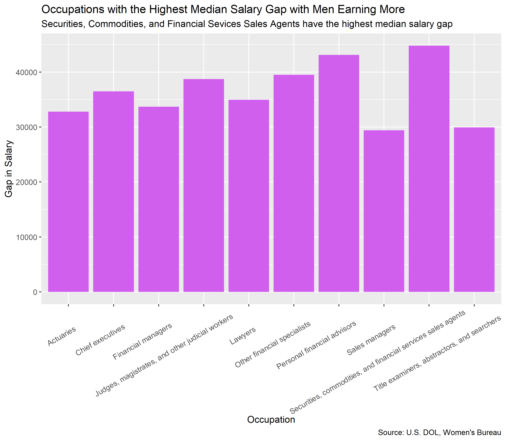

```{r setup, include=FALSE}
knitr::opts_chunk$set(echo = FALSE)

library(tidyverse)
library(distill)
library(ggthemes)
library(knitr)
library(tigris)
library(rvest)
library(janitor)

```

Occupations with the Highest Salaries for Women and Men

```{r}
#How to rearrange the graph so that the bars go in order
#Add dollar signs to the y-axis

include_graphics("women-graph1.png")

include_graphics("men-graph1.png")
```

Occupations with the Highest Median Salary Gap

```{r}
include_graphics("women-graph2.png")


```

