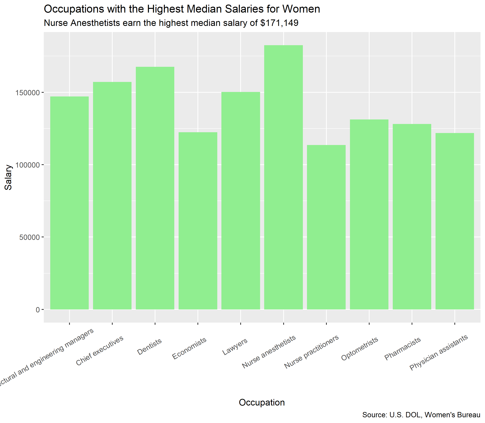

```{r setup, include=FALSE}
knitr::opts_chunk$set(echo = FALSE)

library(tidyverse)
library(distill)
library(ggthemes)
library(knitr)
library(tigris)
library(rvest)
library(janitor)
library(plotly)

```

## Occupations with the Highest Salaries for Women and Men

```{r}



include_graphics("men-graph1.png")

```

## Occupations with the Highest Salary Gap

```{r}

include_graphics("women-graph2.png")

include_graphics("men-graph2.png")
```

## Salary Gap 

```{r}

tab3 <- read_rds("table.rds") 

plot <- tab3 |>
  mutate(gap = abs(men_salary - women_salary)) |>
  ggplot(aes(x = women_salary, y = men_salary, fill = "brown", color = "brown",
             text = paste("Occupation: ", occupation, "\n",
                          "Women's Median Salary: $", women_salary, "\n",
                          "Men's Median Salary: $", men_salary, "\n",
                          "Salary Gap: $", gap, "\n"))) +
  geom_point(size = 0.9) +
  labs(title = "The Salary Gap in Gender by Occupation",
       x = "Women's Median Salary",
       y = "Men's Median Salary") +
  theme(legend.position = "none")

ggplotly(plot, tooltip = "text")

```


